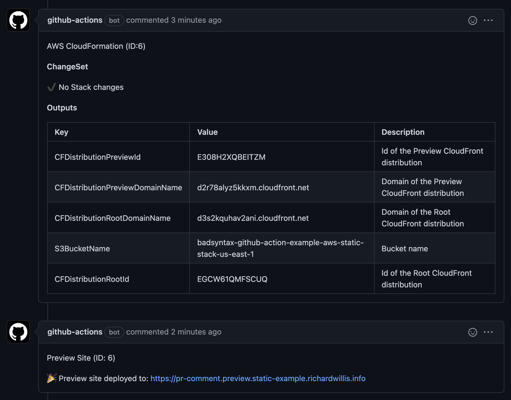

# AWS Static Stack GitHub Action

[](https://github.com/badsyntax/github-action-aws-static-stack/actions/workflows/test.yml)
[](https://github.com/badsyntax/github-action-aws-static-stack/actions/workflows/deploy.yml)

A composite GitHub Action to deploy your static website to the AWS Edge.

## Features

- Preview sites with Pull Request comments
- S3 for origin object storage
- Cloudfront Edge caching
- Separate Root & Preview Cloudfront distributions
  - The Preview distribution uses a Lambda to rewrite the URLs to the correct location in the S3 origin
  - The Root distribution routes directly to the S3 origin and does not use a Lambda, to provide the fastest possible response times
- Flexible stack creation (you provide & own the IaC)

The following GitHub Actions are used:

- [badsyntax/github-action-aws-cloudformation](https://github.com/badsyntax/github-action-aws-cloudformation)
- [badsyntax/github-action-aws-cloudfront](https://github.com/badsyntax/github-action-aws-cloudfront)
- [badsyntax/github-action-aws-s3](https://github.com/badsyntax/github-action-aws-s3)

## Getting Started

You should be somewhat familiar with the following technologies:

- AWS CloudFormation (Infrastructure as Code)
- AWS S3 (Object storage)
- AWS CloudFront (CDN & Edge Caching)
- GitHub Actions (CI/CD)

Please also read the following to understand what AWS Credentials you should use: <https://github.com/aws-actions/configure-aws-credentials#credentials>

### Step 1: Define your Stack

Use the [provided stack](https://github.com/badsyntax/github-action-aws-static-stack/blob/master/cloudformation/cloudformation-s3bucket-stack.yml) and place it somewhere in your repo, for example in location `./cloudformation/cloudformation-s3bucket-stack.yml`.

You are welcome to change the stack as long as you don't change the following outputs:

- `S3BucketName`
- `CFDistributionRootId`
- `CFDistributionPreviewId`

### Step 2: Define the Actions YAML

```yaml
name: 'Deploy'

concurrency:
  group: prod_deploy
  cancel-in-progress: false

on:
  repository_dispatch:
  workflow_dispatch:
  pull_request:
    types: [opened, synchronize, reopened, closed]
  push:
    branches:
      - master

jobs:
  deploy:
    name: 'Deploy'
    runs-on: ubuntu-20.04
    if: github.actor != 'dependabot[bot]' && (github.event_name != 'pull_request' || github.event.pull_request.head.repo.full_name == github.repository)
    steps:
      - uses: actions/checkout@v2

      - name: Configure AWS Credentials
        uses: aws-actions/configure-aws-credentials@v1
        with:
          aws-access-key-id: ${{ secrets.AWS_ACCESS_KEY_ID }}
          aws-secret-access-key: ${{ secrets.AWS_SECRET_ACCESS_KEY }}
          aws-region: us-east-1

      - uses: badsyntax/github-action-aws-static-stack@v0.0.1
        name: Deploy Site
        with:
          cfStackName: 'github-action-example-aws-static-stack'
          cfTemplate: './cloudformation/cloudformation-s3bucket-stack.yml'
          cfApplyChangeSet: ${{ github.event_name != 'repository_dispatch' }}
          gitHubToken: ${{ secrets.GITHUB_TOKEN }}
          awsRegion: 'us-east-1'
          s3BucketName: 'github-action-example-aws-static-stack-us-east-1'
          s3AllowedOrigins: 'https://example.com, https://*.preview.example.com'
          cloudFrontRootHosts: 'example.com'
          cloudFrontPreviewHosts: '*.preview.example.com'
          cloudFrontDefaultRootObject: 'index'
          certificateARN: 'arn:aws:acm:us-east-1:0001112222:certificate/1234abc-1234-1234-abcd-12345'
          srcDir: './out'
          staticFilesGlob: 'css/**'
          lambdaVersion: '1.0.0'
          previewUrlTemplate: 'https://{branchName}.preview.example.com'
          deletePreviewSiteOnPRClose: true
```

### Step 3: Deploy

Send a pull request to your repository to create the stack and deploy a preview site.

Note that `cfApplyChangeSet` must be set to `true` to allow the stack to be created before attempting a deploy. The only time you don't want to set this is when the job is run via webhook (eg `repository_dispatch`).

### Step 4: Adjust Domain Records

Create `CNAME` records that point to the relevant distribution.

For example I have the following records defined:

```console
static-example CNAME 1234abcd.cloudfront.net.
*.preview.static-example CNAME 5678edfgh.cloudfront.net.
```

View more info on using a custom domain: <https://docs.aws.amazon.com/AmazonCloudFront/latest/DeveloperGuide/CNAMEs.html#CreatingCNAME>

## Action Inputs

All of the following inputs are required:

| Name                          | Description                                                                                      | Example                                                                    |
| ----------------------------- | ------------------------------------------------------------------------------------------------ | -------------------------------------------------------------------------- |
| `cfStackName`                 | The name of the Cloudformation stack to be created                                               | `example-com-static-cloudformation-stack`                                  |
| `cfTemplate`                  | The relative path to the CloudFormation stack template                                           | `./cloudformation/s3bucket_with_cloudfront.yml`                            |
| `cfApplyChangeSet`            | Whether to apply the CloudFormation ChangeSet (if any)                                           | `true`                                                                     |
| `gitHubToken`                 | GitHub Token used for commenting on Pull Requests                                                | `${{ secrets.GITHUB_TOKEN }}`                                              |
| `awsRegion`                   | 'The AWS region in which to create the stack. You should set this to `us-east-1`                 | `us-east-1`                                                                |
| `s3BucketName`                | The name of S3 bucket to be created, to store your static files. Must end with region name       | `example.com-us-east-1`                                                    |
| `s3AllowedOrigins`            | A list of allowed domains to request resources from S3                                           | `https://example.com,https://*.preview.example.com`                        |
| `cloudFrontRootHosts`         | A list of hosts assigned to the Root CloudFront distribution                                     | `example.com`                                                              |
| `cloudFrontPreviewHosts`      | A list of hosts assigned to the Preview CloudFront distribution                                  | `*.preview.example.com`                                                    |
| `cloudFrontDefaultRootObject` | The CloudFront default root object                                                               | `index`                                                                    |
| `certificateARN`              | ARN of the certificate for the root and preview domains                                          | `arn:aws:acm:us-east-1:1234567:certificate/123abc-123abc-1234-5678-abcdef` |
| `srcDir`                      | Path to build/out directory that contains the static files                                       | `./out`                                                                    |
| `staticFilesGlob`             | Glob pattern for immutable static files                                                          | `_next/**`                                                                 |
| `lambdaVersion`               | The lambda version. Required to deploy a new lambda. You must update this if changing the lambda | `1.0.0`                                                                    |
| `previewUrlTemplate`          | The preview url template                                                                         | `https://{branchName}.preview.example.com`                                 |
| `deletePreviewSiteOnPRClose`  | Whether to delete the preview site on PR close                                                   | `true`                                                                     |

## ScreenShots



## Debugging

Check the Action output for logs.

If you need to see more verbose logs you can set `ACTIONS_STEP_DEBUG` to `true` as an Action Secret.

Detailed stack logs can be found in CloudFormation in the AWS Console.

## Creating Your Own AWS Static Stack

This GitHub Action combines various other Actions and you can do the same if you require more flexibility. Refer to [`action.yaml`](https://github.com/badsyntax/github-action-aws-static-stack/blob/master/action.yml) for example usage of the various Actions.

## License

See [LICENSE.md](./LICENSE.md).
